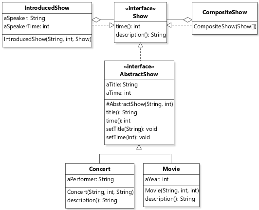

# Chapter 7 Solutions to Practice Exercises

## Exercise 1

```java
public class SponsoredConcert extends Concert
{
   private String aSponsor;
   private int aSponsorTime;

   public SponsoredConcert(String pTitle, String pPerformer, int pTime, 
      String pSponsorName, int pSponsorTime)
   {	
      super(pTitle, pPerformer, pTime);
      aSponsor = pSponsorName;
      aSponsorTime = pSponsorTime;
   }
	
   @Override
   public String description()
   {
      return String.format("%s by %s sponsored by %s", title(), aPerformer, aSponsor);
   }
	
   @Override
   public int time()
   {
      return super.time() + aSponsorTime;
   }
}

```

## Exercise 2

A solution that would make proper use of inheritance would be to access `aPerformer` through a getter method, either public or protected. 

# Exercise 3

Here is `AbstractShow`:

```java
public abstract class AbstractShow implements Show
{
   private String aTitle;
   private int aTime;
	
   protected AbstractShow(String pTitle, int pTime)
   {
      aTitle = pTitle;
      aTime = pTime;
   }
	
   public String title()
   {
      return aTitle;
   }
	
   public void setTitle(String pTitle)
   {
      aTitle = pTitle;
   }
	
   public int time()
   {
      return aTime;
   }
	
   public void setTime(int pTime)
   {
      aTime = pTime;
   }
}
```

And here is the refactored `Concert` as an example. Class `Movie` is conceptually similar:

```java
public class Concert extends AbstractShow
{
   protected String aPerformer;
	
   public Concert(String pTitle, String pPerformer, int pTime)
   {
      super(pTitle, pTime);
      aPerformer = pPerformer;
   }
	
   @Override
   public String description()
   {
      return String.format("%s by %s", title(), aPerformer);
   }
}
```

# Exercise 4

Note how the composite and decorator classes do not extend the abstract class.



[Diagram file](c7-exercise4.class.jet)

# Exercise 5

We add the follow template method in `AbstractShow`:

```java
@Override
public final String description() 
{
   return String.format("%s: %s (%d minutes", title(), extra(), time());
}

protected abstract String extra();
```

The template method need to get additional information from subclasses. This can be added to the design through the use of a call to an abstract method `extra()` that will return the extra information.

Sample mplementation of `extra()` in `Concert`:

```java
@Override
protected String extra()
{
   return "by " + aPerformer;
}
```

and in `SponsoredConcert`:

```java
@Override
public String extra()
{
   return super.extra() + " sponsored by " + aSponsor;
}
```

---
<a rel="license" href="http://creativecommons.org/licenses/by-nc-nd/4.0/"></a>

Unless otherwise noted, the content of this repository is licensed under a <a rel="license" href="http://creativecommons.org/licenses/by-nc-nd/4.0/">Creative Commons Attribution-NonCommercial-NoDerivatives 4.0 International License</a>. 

Copyright Martin P. Robillard 2019